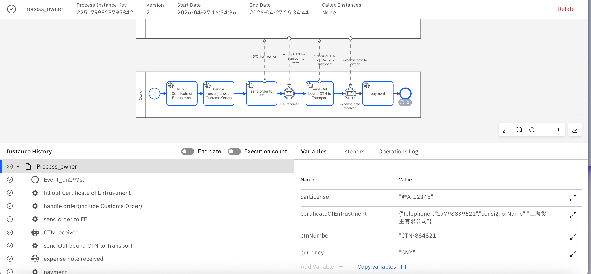
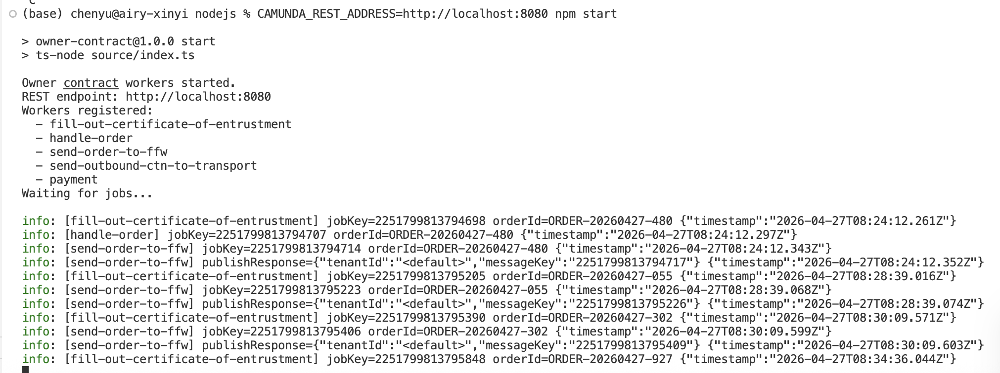

# Owner (货主) 模块实现总结

## 一、实现功能

### 1. 完整 Node.js 项目
在 `code-camunda8/owner/nodejs/` 下创建了可独立运行的 Camunda 8 Worker 项目：

| 文件 | 作用 |
|---|---|
| `source/config.ts` | 常量定义：PARTY 参与方 ID、JOB_TYPES 任务类型、MESSAGE_NAMES 消息名、PROCESS_IDS |
| `source/types.ts` | 实体类型：CommonFields、CertificateOfEntrustment、OwnerOrder、各消息 Payload 接口 |
| `source/messages.ts` | 消息流函数：构造 M1/M* 出站消息、解析 M22/expense 入站消息、orderId/containerId/vesselId 格式校验 |
| `source/workers.ts` | 5 个 Camunda 8 Job Worker，对应 owner.bpmn 全部任务 |
| `source/index.ts` | 入口：注册并启动 workers |
| `source/demo.ts` | 一键全流程：部署 BPMN → 启动实例 → mock 入站消息 → 流程结束 |
| `source/mock-inbound.ts` | 独立脚本：在 workers 运行期间单独发布入站消息 |
| `test/owner.spec.ts` | 20 个 Jest 单元测试，覆盖消息构造、解析、校验规则 |

### 2. BPMN C7 → C8 转换
`code-camunda8/owner/bpmn/owner.bpmn` 原为 Camunda Platform 7 格式，已完整转换为 C8：
- `camunda:` namespace → `zeebe:` namespace
- `camunda:delegateExpression` / `camunda:type="external"` → `zeebe:taskDefinition type="..."`
- `modeler:executionPlatform="Camunda Platform"` → `"Camunda Cloud"`
- userTask / sendTask 统一改为 serviceTask（C8 外部任务模型）

---

## 二、遇到的问题与 Bug

### Bug 1：BPMN 是 C7 格式，Modeler 无法部署到 C8
- **现象**：Modeler 部署对话框提示 `Should point to a running Camunda REST API`，端口为 `/rest`
- **根因**：C7 与 C8 部署 API 完全不兼容
- **解决**：将 BPMN 全部扩展元素替换为 C8 等效写法

### Bug 2：部署报错 `Must have exactly one zeebe:subscription extension element`
- **现象**：`owner.bpmn` 部署失败，指向 `Message_2bdi5a5` 和 `Message_3d50rb2`
- **根因**：C8 中用于 catch event 的 `<bpmn:message>` 必须声明关联键
- **解决**：给两个消息添加 `<zeebe:subscription correlationKey="=orderId" />`

### Bug 3：TypeScript 编译错误 `Type 'CertificateOfEntrustment' is not assignable to type 'JSON'`
- **现象**：`workers.ts` 中 `job.complete({ certificateOfEntrustment, ... })` 报 TS2322
- **根因**：Camunda 8 SDK 的 `JSON` 类型要求 `[key: string]: any` 索引签名，纯 interface 不满足
- **解决**：`CertificateOfEntrustment` 和 `OwnerOrder` 接口添加 `[key: string]: any`

### Bug 4：Jest 无法运行 TypeScript 测试
- **现象**：`npx jest` 报错 `Cannot use import statement outside a module`
- **根因**：缺少 ts-jest transformer 配置
- **解决**：创建 `jest.config.js`，配置 `preset: 'ts-jest'`

### Bug 5：Demo 运行后流程走不完（核心时序 Bug）
- **现象**：Operate 中实例卡在 `CTN received`，后续 `send Out bound CTN to Transport`、`payment` 未激活
- **根因 A（时序）**：C8 消息关联要求 catch event **先激活**再发消息，发早了消息会被丢弃
- **根因 B（命名）**：BPMN 中消息名 `Message_owner_empty_CTN_received` 与代码发布的 `ctn-to-owner` 不匹配，消息无法路由
- **解决**：
  - 增加 demo.ts 等待时间（实例创建后 3s 发第一条、间隔 5s 发第二条、结束前再等 5s）
  - 统一 BPMN 消息名：`Message_owner_empty_CTN_received` → `ctn-to-owner`，`Message_expense_note_received` → `expense-note-to-owner`

---

## 三、最小执行步骤

确保 Camunda 8 Run 已启动（`http://localhost:8080` 可访问）。

```bash
cd code-camunda8/owner/nodejs
npm install
CAMUNDA_REST_ADDRESS=http://localhost:8080 npm run demo
```

`npm run demo` 会自动完成：
1. 部署 `owner.bpmn` 到 Camunda 8
2. 启动一个流程实例（自动生成 `orderId`）
3. Workers 自动执行前 3 个任务
4. Mock 发布 `ctn-to-owner` 消息（实例到达 `CTN received` 后）
5. Mock 发布 `expense-note-to-owner` 消息（`send Out bound CTN to Transport` 完成后）
6. `payment` worker 执行，流程结束

全程约 13 秒，终端会打印每步日志。完成后可在 Operate 中查看完整实例历史。

如需单独观察 workers 与消息的时序，可分两个终端执行：
```bash
# 终端 1：启动 workers（保持运行）
CAMUNDA_REST_ADDRESS=http://localhost:8080 npm start

# 终端 2：手动发 mock 消息
CAMUNDA_REST_ADDRESS=http://localhost:8080 npm run mock:inbound -- --orderId=ORDER-YYYYMMDD-NNN
```

---

## 四、成果展示

下图展示了 `npm run demo` 一键运行后的 **Camunda Operate 流程实例监控界面**，完整验证了 Owner (货主) 出口流程的正确性：




### 截图说明

- **流程实例信息**：Process Instance Key `2251799813795842`，Version 2，于 `2026-04-27 16:34:36` 启动，`16:34:44` 结束，**全程仅 8 秒**完成端到端流程。
- **Instance History**：全部 8 个元素均已完成（绿色对勾），无失败或卡住：
  1. `Event_0n197sl` — 开始事件
  2. `fill out Certificate of Entrustment` — 填写委托书
  3. `handle order(include Customs Order)` — 处理订单（含报关单）
  4. `send order to FF` — 发送订单到货代（M1: `order-to-ffw`）
  5. `CTN received` — 收到车队送达的空箱（M22: `ctn-to-owner`）
  6. `send Out bound CTN to Transport` — 发送出口重箱给车队（M*: `outbound-ctn-to-transport`）
  7. `expense note received` — 收到费用单（`expense-note-to-owner`）
  8. `payment` — 完成付款，流程结束
- **Variables 面板**：验证了消息变量的正确传递，包括 `ctnNumber: "CTN-884821"`、`carLicense: "沪A-12345"`、`currency: "CNY"`、`certificateOfEntrustment` 等，完全符合命名规则文档的字段规范。
- **BPMN 图高亮**：所有任务与消息事件均显示为已完成状态（灰色边框 + 结束标记），末端结束事件旁标记 `1`，表示流程正常结束。

该成果证明：Owner 模块的 **BPMN 建模、Worker 实现、消息契约定义、Mock 测试** 全部贯通，能够在 Camunda 8 上完整运行。
