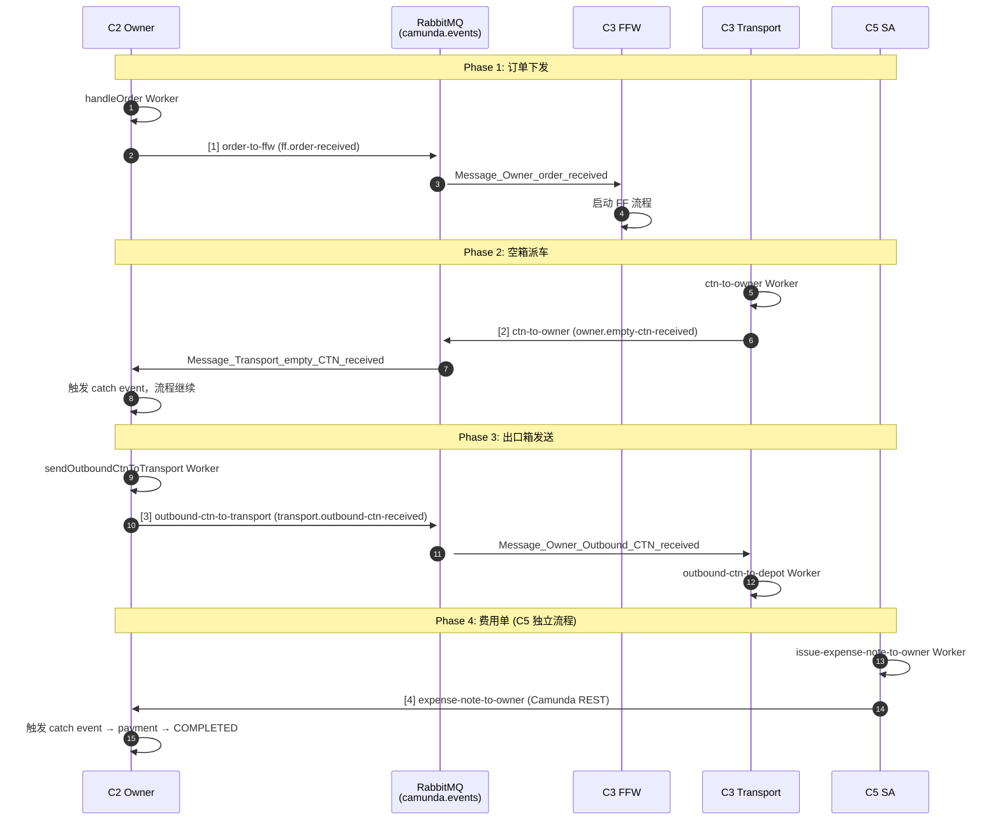

# C2 Owner 接口联调实现报告（2025-05-25）

## 1. 整体架构

### 1.1 参与方与通信拓扑

```
┌─────────────────────────────────────────────────────────────────────────────┐
│                              RabbitMQ (camunda.events)                       │
│  ┌─────────────────┐    ff.order-received    ┌─────────────────────────┐    │
│  │  C2 Owner       │ ───────────────────────►│  C3 FFW                 │    │
│  │                 │   Message_Owner_order   │  (Freight Forwarder)    │    │
│  │  ┌───────────┐  │       _received         │                         │    │
│  │  │ Outbound  │  │                         │  ┌─────────────────┐    │    │
│  │  │ Adapter   │  │◄────────────────────────│  │ C3 Transport    │    │    │
│  │  └───────────┘  │  owner.empty-ctn-       │  │                 │    │    │
│  │       │         │  received               │  │ ctn-to-owner    │    │    │
│  │       ▼         │  Message_Transport_     │  │ outbound-ctn-   │    │    │
│  │  ┌───────────┐  │  empty_CTN_received     │  │ to-depot        │    │    │
│  │  │ RabbitMQ  │  │                         │  └─────────────────┘    │    │
│  │  │ Publisher │  │ ───────────────────────►│                         │    │
│  │  └───────────┘  │  transport.outbound-    │                         │    │
│  │       ▲         │  ctn-received           │                         │    │
│  │       │         │  Message_Owner_         │                         │    │
│  │  ┌───────────┐  │  Outbound_CTN_received  │                         │    │
│  │  │ RabbitMQ  │  │                         │                         │    │
│  │  │ Consumer  │  │                         │                         │    │
│  │  └───────────┘  │                         │                         │    │
│  │       │         │                         │                         │    │
│  │  ┌───────────┐  │                         │  ┌─────────────────┐    │    │
│  │  │ Camunda   │  │◄────────────────────────│  │ C5 SA           │    │    │
│  │  │ REST      │  │  expense-note-to-owner  │  │ (Shipping       │    │    │
│  │  │ (fallback)│  │  (Camunda REST)         │  │  Agency)        │    │    │
│  │  └───────────┘  │                         │  └─────────────────┘    │    │
│  └─────────────────┘                         └─────────────────────────┘    │
└─────────────────────────────────────────────────────────────────────────────┘
```

### 1.2 C2 核心组件

| 组件 | 职责 | 对应文件 |
|---|---|---|
| **Outbound Adapter** | 统一路由 outbound 消息：C3 消息走 RabbitMQ，其他走 Camunda REST fallback | `source/outbound-adapter.ts` |
| **RabbitMQ Publisher** | 将 C2 消息发布到 `camunda.events` exchange，适配 C3 的消息格式 | `source/rabbitmq/publisher.ts` |
| **RabbitMQ Consumer** | 订阅 `camunda.owner` 队列，收 C3 消息后转换为 Camunda Message 注入 C2 BPMN | `source/rabbitmq/consumer.ts` |
| **Workers** | 5 个 Job Worker（handleOrder, sendOrderToFfw, sendOutboundCtnToTransport, fillCertificate, payment） | `source/workers.ts` |

---

## 2. 每条信息流的交互策略

### 2.1 消息流总览



### 2.2 每条消息的交互策略

| # | 消息 | 方向 | 通道 | 触发时机 | 消息格式 | 关键变量 |
|---|---|---|---|---|---|---|
| 1 | `order-to-ffw` | C2 → C3 FFW | **RabbitMQ** | C2 `sendOrderToFfw` Worker 执行后自动发送 | `CamundaRabbitMQMessage` (标准化信封：eventId, timestamp, source, camundaMessageName, correlationKey, variables) | `orderId`, `shipperName`, `consignee`, `pol`, `pod`, `commodity`, `ctnType` |
| 2 | `ctn-to-owner` | C3 Transport → C2 | **RabbitMQ** | C3 `ctn-to-owner` Worker 执行后自动发送 | `CamundaRabbitMQMessage` | `orderId`, `ctnNumber`, `handoverTime`, `driverName`, `carLicense`, `senderId` |
| 3 | `outbound-ctn-to-transport` | C2 → C3 Transport | **RabbitMQ** | C2 `sendOutboundCtnToTransport` Worker 执行后自动发送 | `CamundaRabbitMQMessage` | `orderId`, `ctnNumber`, `senderId` |
| 4 | `expense-note-to-owner` | C5 → C2 | **Camunda REST** | C5 `issue-expense-note-to-owner` Worker 内手动调用 `publishMessage` | Camunda Message (name, correlationKey, timeToLive, variables) | `orderId`, `expenseId`, `expenseAmount`, `currency`, `senderId` |

### 2.3 消息依赖关系

```
[1] order-to-ffw
    │
    ▼
[C3 FFW 启动] ──► [C3 FFW 内部执行]
    │                  (send-so-to-sa ∥ send-order-info-to-cb)
    ▼
[C3 FFW 完成] ──► [C3 Transport 启动]
    │
    ▼
[2] ctn-to-owner ──────────────────────────────► [C2 收到空箱，流程继续]
    │                                                  │
    ▼                                                  ▼
[C2 sendOutboundCtnToTransport]            [C2 等待 expense-note-to-owner]
    │                                                  ▲
    ▼                                                  │
[3] outbound-ctn-to-transport ───────────────────────┤
    │                                                  │
    ▼                                                  │
[C3 Transport outbound-ctn-to-depot]                 │
    │                                                  │
    ▼                                                  │
[C5 独立流程: issue-expense-note-to-owner] ────────────┘
    │
    ▼
[4] expense-note-to-owner ──► [C2 payment] ──► [C2 COMPLETED]
```

### 2.4 交互策略设计要点

**为什么 C3 走 RabbitMQ，C5 走 Camunda REST？**

- C3 组以 RabbitMQ 为核心中间件，所有跨组消息经过 `camunda.events` exchange。C2 通过 `outbound-adapter.ts` 适配此架构。
- C5 组没有 RabbitMQ 基础设施，Worker 直接调用 Camunda REST `publishMessage`。C2 保持 REST 通道作为 fallback。

**C2 为什么需要 RabbitMQ Consumer？**

- C3 Transport 的 `ctn-to-owner` 是 ServiceTask（非 SendTask），Worker 内通过 RabbitMQ 发消息，不走 Camunda 消息机制。
- C2 Consumer 扮演"协议转换器"：将 C3 的 RabbitMQ 消息转换为 Camunda Message，再注入 C2 BPMN。

**消息顺序如何保障？**

1. **BPMN 引擎阻塞**：`ctn-to-owner` 和 `expense-note-to-owner` 是 Intermediate Catch Event，流程挂起等待消息，天然保证顺序。
2. **CorrelationKey**：所有消息以 `orderId` 为 correlationKey，确保路由到正确实例。
3. **超时兜底**：E2E 测试设置 10s 超时等待真实消息，超时后 mock fallback，避免永久卡住。

---

## 3. 目前的实现情况和联调情况

### 3.1 接口实现状态

| 消息 | 方向 | 状态 | 验证方式 |
|---|---|---|---|
| `order-to-ffw` | C2 → C3 FFW | ✅ 已联调 | RabbitMQ 路由到 `ff.order-received`，C3 Consumer 转发触发 FFW 流程 |
| `ctn-to-owner` | C3 Transport → C2 | ✅ 已联调 | C3 Worker 发 `owner.empty-ctn-received`，C2 Consumer 映射为 `ctn-to-owner` 注入 BPMN |
| `outbound-ctn-to-transport` | C2 → C3 Transport | ✅ 已联调 | RabbitMQ 路由到 `transport.outbound-ctn-received`，C3 Consumer 转发触发 Transport 流程 |
| `expense-note-to-owner` | C5 → C2 | ✅ 已联调 | C5 Worker 调用 Camunda REST `publishMessage`，C2 BPMN 直接捕获 |

**结论：4 条外部消息接口全部打通，本地 E2E 测试通过。**

### 3.2 启动程序

```bash
# 生产/联调常驻
npx ts-node source/index.ts

# 跨组 E2E（最常用）：等真实消息，超时 fallback mock
npx ts-node source/e2e-cross-group.ts

# 严格跨组 E2E：无 fallback，FAIL if 未收到真实消息
npx ts-node source/e2e-strict.ts
```

### 3.3 已解决的关键问题

| 问题 | 根因 | 解决方式 |
|---|---|---|
| C2 → C3 消息名不匹配 | C2 用 `lower-case-with-hyphens`，C3 期望 `Message_XXX_received` | `MESSAGE_MAPPING` 映射表（`rabbitmq/config.ts`） |
| C3 → C2 无消息返回 | C3 `ctn-to-owner` Worker 只 `job.complete()` 不写回 | C3 Worker 内增加 RabbitMQ `publisher.publish()` |
| C5 → C2 无消息 | C5 BPMN 无 `expense-note-to-owner` 消息定义 | C5 Worker 内本地增加 `publishMessage` 调用 |
| 混合通信适配 | C3 走 RabbitMQ、C5 走 REST，C2 需同时维护两套 | `outbound-adapter.ts` 统一路由：C3 → RabbitMQ，其他 → REST fallback |

---

## 4. 未来计划

### 4.1 还需要别的组实现的接口

| 组 | 需要做的事 | 优先级 | 说明 |
|---|---|---|---|
| **C5 SA** | `issue-expense-note-to-owner` Worker 内增加 `publishMessage({ name: "expense-note-to-owner", ... })` | 🔴 高 | 本地已验证，需同步到远程仓库。当前 C5 远程代码不发此消息，C2 联调时无法收到 |
| **C3 FFW** | 无 | 🟢 无需 | C3 已通过 RabbitMQ 联调，无需额外修改 |
| **C3 Transport** | 无 | 🟢 无需 | C3 已通过 RabbitMQ 联调，无需额外修改 |

### 4.2 还存在的问题

| # | 问题 | 影响 | 建议 |
|---|---|---|---|
| 1 | **混合通信架构**：C3 走 RabbitMQ，C5 走 Camunda REST，C2 需维护两套通道 | 增加复杂度，C5 无法享受 RabbitMQ 的可靠性机制（DLX、TTL、持久化） | 协商全组统一通信方式。建议全部迁移至 RabbitMQ，使用 `CamundaRabbitMQMessage` 标准信封 |
| 2 | **C5 消息格式不统一**：C5 直接调 `publishMessage`，无标准化消息信封（缺少 eventId、timestamp、source、retryCount 等元数据） | 无法做统一的消息追踪、日志审计、重试机制 | C5 接入 RabbitMQ 并使用 `CamundaRabbitMQMessage` 格式 |
| 3 | **C3 BPMN 不规范**：`ctn-to-owner` 和 `send-equipment-receipt-to-transport` 是 ServiceTask 而非 SendTask，消息发送逻辑写在 Worker 内 | 消息发送与 BPMN 模型脱节，不易从流程图直观理解交互关系 | 建议将消息发送节点改为 SendTask，并关联 `<bpmn:message>` 定义 |
| 4 | **C5 BPMN 不规范**：`Task_IssueExpenseNote` 是 ServiceTask，无 `<bpmn:message>` 定义 | 同上 | 建议改为 SendTask + `<bpmn:message name="expense-note-to-owner">` |
| 5 | **缺少版本控制**：`CamundaRabbitMQMessage` 无 `version` 字段 | 后续若消息格式升级，Consumer 无法做向后兼容 | 消息信封增加 `version: '1.0'` 字段 |
| 6 | **重试策略未实现**：`retryCount`/`maxRetries` 有定义但 Consumer 未使用 | 消息处理失败时直接丢弃（`nack(msg, false, false)`），不触发重试 | Consumer 根据 `retryCount < maxRetries` 决定是否重入队重试 |

### 4.3 下一步行动

1. **推动 C5 同步代码**：让 C5 组员在 `issue-expense-note-to-owner` Worker 内增加 `publishMessage` 调用（代码见 4.1）。
2. **统一通信协议**：提议全组会议，讨论是否将 C5 也迁移至 RabbitMQ，实现统一的消息交互协议。
3. **规范化 BPMN**：建议 C3 和 C5 将消息发送节点从 ServiceTask 改为 SendTask，使消息流在 BPMN 图中可直观表达。
