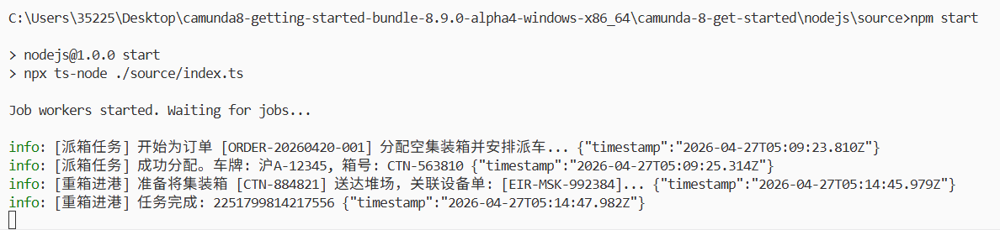
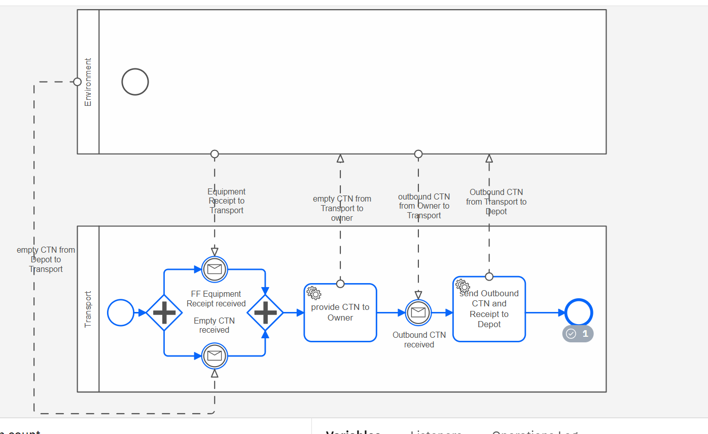

# 发送的json
## 实验步骤
1. 启动c8.exe
2. 启动camunda
3. camunda部署一个实例，此时可以在operate上看到一个卡住的进程
4. 启动index.ts 指令npx ts-node index.ts
5. postman发送transport下面列出的三条json文件(使用sendMsg.ts后可以新开一个终端执行文件代替这些)
6. 可以观察到operate上进程继续进行
## transport
接口名：
http://localhost:8080/v2/messages/publication
{
  "name": "Message_FF_Equipment_Receipt_received",
  "correlationKey": "ORDER-20260420-001",
  "timeToLive": 300000,
  "variables": {
    "receiptId": "EIR-MSK-992384",
    "pickupDepot": "DEPOT-BAOSHAN-01"
  }
}

{
  "name": "Message_Transport_empty_CTN_received",
  "correlationKey": "ORDER-20260420-001",
  "timeToLive": 300000,
  "variables": {
    "ctnNumber": "CTN-884821"
  }
}
{
  "name": "Message_Owner_Outbound_CTN_received",
  "correlationKey": "ORDER-20260420-001",
  "timeToLive": 300000,
  "variables": {
    "ctnNumber": "CTN-884821"
  }
}

