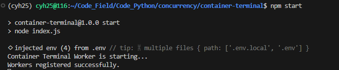
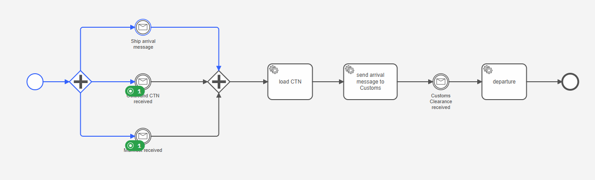
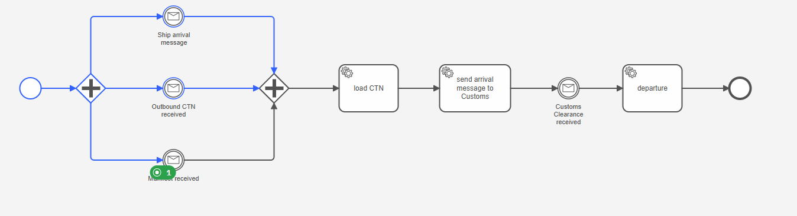
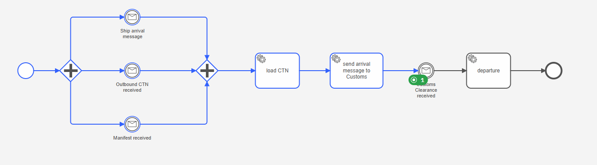
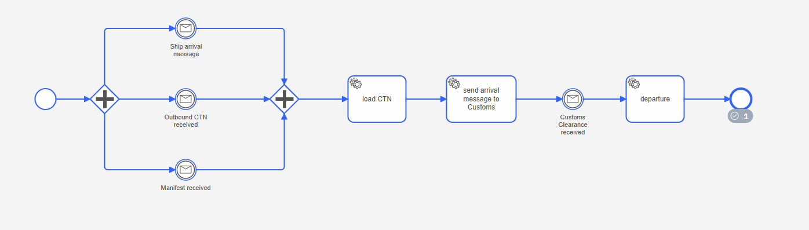

# 运行准备
在container-terminal下运行`npm start`


# 测试
1. 发送`ship-arrival-message`

message:
```
{
  "name": "ship-arrival-message",
  "correlationKey": "ORDER-20260518-945-STEP1-SHIP",
  "variables": {
    "vesselArrived": true,
    "shipArrivalTime": "2026-05-18T08:59:26.467Z"
  },
  "timeToLive": 60000
}
```


2. 发送`outbound-ctn-received`

message:
```
{
  "name": "outbound-ctn-received",
  "correlationKey": "ORDER-20260518-945-STEP2-SHIP-CTN",
  "variables": {
    "outboundCtnReceived": true,
    "outboundCtnReceivedAt": "2026-05-18T08:59:26.521Z"
  },
  "timeToLive": 60000
}
```


3. 发送`manifest-received`

message:
```
{
  "name": "manifest-received",
  "correlationKey": "ORDER-20260518-945-STEP3-SYNC-DONE",
  "variables": {
    "manifestReceived": true,
    "manifestReceivedAt": "2026-05-18T08:59:26.563Z"
  },
  "timeToLive": 60000
}
```


4. 发送`customs-clearance-received`

message:
```
{
  "name": "customs-clearance-received",
  "correlationKey": "ORDER-20260518-945-STEP4-COMPLETED",
  "variables": {
    "clearanceStatus": "APPROVED",
    "customsClearanceReceived": true,
    "customsClearanceReceivedAt": "2026-05-18T08:59:32.642Z"
  },
  "timeToLive": 60000
}
```

